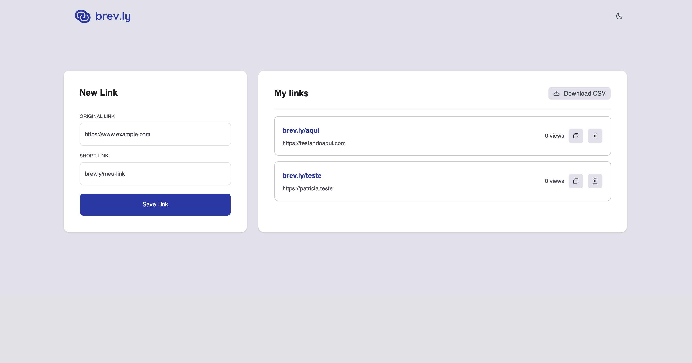

# Brev.ly

A full-stack URL shortening and management platform — create, track,
and manage short links efficiently.

---

## 🧩 Overview

Users can:
- Generate short links with validation and duplicate prevention
- Track access counts
- Manage and delete links
- Export data as CSV via Cloudflare R2 CDN

---

## 🏗️ Architecture

Monorepo with two applications:

- **client** — React SPA built with Vite
- **server** — Fastify API handling business logic and persistence

---

## ⚙️ Tech stack

### Frontend
React 19 · TypeScript · Vite · React Router · Tailwind CSS · shadcn/ui · Zod · React Query · React Hook Form

### Backend
Fastify · TypeScript · PostgreSQL · Drizzle ORM · Zod · Swagger · Docker

### Tooling
ESLint · Prettier · Vitest · GitHub Actions (CI/CD)

---

## ✨ Features

- Short URL generation with validation and duplicate prevention
- Redirection to original URLs
- Access count tracking with real-time sync across tabs via `BroadcastChannel`
- Infinite scroll via `IntersectionObserver`
- CSV export stored on Cloudflare R2, accessible via CDN
- Dark mode support
- API documentation via Swagger UI
- Automated deploy via GitHub Actions → AWS S3 + CloudFront

---

## 📦 Getting started

- [Client](./client/README.md)
- [Server](./server/README.md)

---

## 👩‍💻 Author

Created by **Patricia Segantine** — Frontend Developer
[LinkedIn](https://linkedin.com/in/patriciasegantine) · [Portfolio](https://patriciasegantine.vercel.app/)
